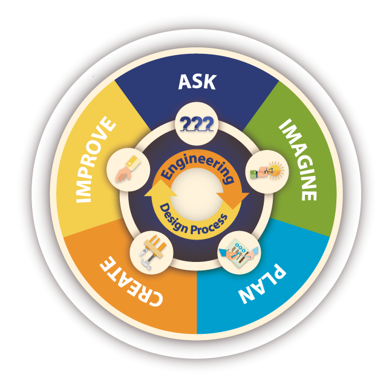

# Advanced CSS Challenge: Professional Portfolio

## USER STORY

AS AN employer
I WANT to view a potential employee's deployed portfolio of work samples
SO THAT I can review samples of their work and assess whether they're a good candidate for an open position.

## ACCEPTANCE CRITERIA

GIVEN I need to sample a potential employee's previous work
WHEN I load their portfolio
THEN I am presented with the developer's name, a recent photo or avatar, and links to sections about them, their work, and how to contact them
WHEN I click one of the links in the navigation
THEN the UI scrolls to the corresponding section
WHEN I click on the link to the section about their work
THEN the UI scrolls to a section with titled images of the developer's applications
WHEN I am presented with the developer's first application
THEN that application's image should be larger in size than the others
WHEN I click on the images of the applications
THEN I am taken to that deployed application
WHEN I resize the page or view the site on various screens and devices
THEN I am presented with a responsive layout that adapts to my viewport

 

            </section>
        <section class="content">
            

                
                

                    
Project

                

            

            

                
                

                    
Project

                

            

            

                
                

                    
Project

                

            

            

                
                

                    
Project

                

            

            

                
                

                    
Project

                

            

        </section>

.about {
    
    background-color:green;
    padding: 1pt;
    border-radius: 10px;

header {
    justify-content: space-between;
    align-items: baseline;
    display: flex;
    margin-left: 5pt;
    margin-right: 5pt;

}
header {
    justify-content: space-between;
    align-items: baseline;
    
}

}
nav {
    align-items: center;
    justify-content: center;
    display:flex
}

a:hover {
    background-color: green;
}
.content{
    display: flex;
    flex-wrap:wrap;
    justify-content: space-evenly;
    gap:1%;
    width:50%;

}
.project{
    max-width: 45%;
    width:43%;
    position: relative;
}

.project-image {
    width: 95%;
}

.project-title{
    position:absolute;
    background:green;
    bottom:30px;
    margin:1%;
    padding:1%;
}

.project-title p{
    letter-spacing: 2px;
    color:white;
}
.intro-header {
    display: flex;
    flex-direction: column;
    justify-content:space-evenly;   
}
